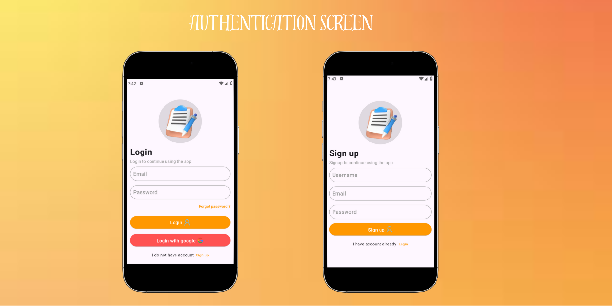
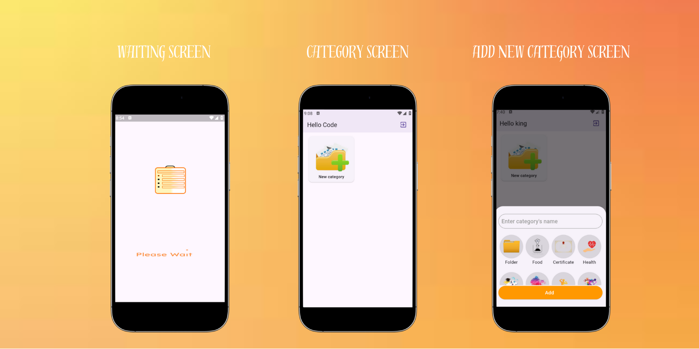
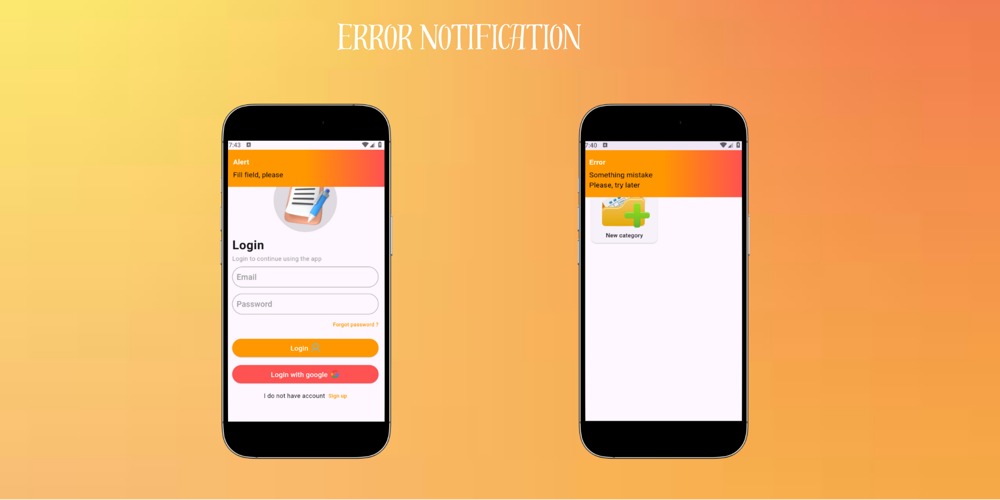

# *Note App* 📝🔒

Welcome to *Note App* 🌟📝! This app is designed to help you create, organize, and secure your notes with ease. Whether you’re jotting down quick thoughts or keeping track of detailed information, **Note App** ensures a seamless and feature-rich experience. 🧰✨

With features like secure login, note categorization, image attachments, and password protection for notes, staying organized has never been this convenient! 🚀🔑

---

## *🌟 Features 🌟*

### 1. *Authorization (Login and Sign Up)* 🔐

Secure your notes with a login and sign-up system:

- *User Authentication:* Ensures only authorized users can access the app. 🔓🛡️  
- *Smooth Animations:* Enjoy sleek and modern animations during login and sign-up. 🚀

---

### 2. *Splash Screen and Wait Page* 🙌🔄

Get a smooth start with an attractive splash screen and wait page while the app prepares to load:

- *Beautiful Design:* A welcoming entry into the app. 🌟🌈  
- *Wait Page Animation:* Engaging animation during product upload. 🔄

---

### 3. *Category Management* 🌐📝

Organize your notes into categories:

- *Add Categories:* Create custom categories by adding a name and image. 🖋️📸  
- *Edit Categories:* Update category names and images as needed. 🗒📷  
- *Delete Categories:* Remove categories you no longer need. 🗑️

---

### 4. *Notes Page* 📑✏️

Manage your notes efficiently with a user-friendly notes page:

- *Add Notes:* Quickly create new notes with text and optional images. 📝📸  
- *Edit Notes:* Modify existing notes with ease. 🔧📷  
- *Lock Notes:* Protect sensitive notes with a password for extra security. 🔒🔐

---

### 5. *Sign Out* 🚪

Easily log out from the app when needed:

- *Secure Exit:* Ensures your data remains protected after logging out. 🛡️  
- *Re-login Required:* Only authorized users can re-access the app. 🔓

---

### 6. **Error Notifications ⚠️**
   - **Error Handling**: The app provides user-friendly error notifications for different scenarios:
     - **Login/Signup Errors**: Display error messages like "Invalid username or password!" or "Username already exists."
     - **Category Management Errors**: Handle errors such as "Category name cannot be empty" or "Failed to upload category image."
     - **Note Errors**: Show messages when a note cannot be saved or edited due to validation failures.
   - **Notification Display**: Errors are shown in a sleek, non-intrusive pop-up notification at the top right of the screen. The notification can be closed by the user by clicking the "X" button. 

---

## *📧 Contact Us 📧*

If you have any questions, suggestions, or feedback, we would love to hear from you! 🤗📞

- *Email:* noteappsupport@example.com 📧  
- *LinkedIn:* [@NoteApp](https://www.linkedin.com/in/noteapp) 📝  
- *WhatsApp:* [Contact us on WhatsApp](https://wa.me/+1234567890) 📱

---

### *🌟 Thank you for using Note App! 🌟*

We appreciate your support and feedback to keep improving your experience with *Note App*! 🎉📝

